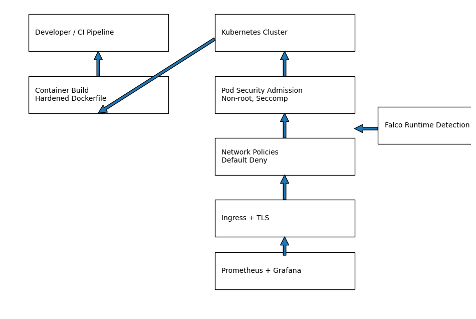

# portfolio-k8s-security

This repository defines Kubernetes security controls used across the
DevSecOps portfolio. The focus stays on workload hardening, network
isolation, admission enforcement, runtime detection, and operational
visibility inside the cluster.

This repository works together with CI security pipelines, daily
security automation, and the portfolio threat model to provide full
lifecycle coverage.

## Badges and Status

[](https://github.com/asadyare/portfolio-daily-security/actions/workflows/security-alerting-and-reporting.yml)

[](https://falco.org/)

## Stack

- Kubernetes
- Docker
- Node.js
- Nginx Ingress
- Trivy
- kube-bench
- kube-linter
- Prometheus
- Grafana
- GitHub Actions

## diagram Architecture

[](docs/architecture.png)

## Platform Kubernetes security focused

### Purpose and Scope

This repository enforces security at deploy time and runtime.
Application code and CI logic live in other repositories.

### Scope includes

Kubernetes workload hardening Pod Security Admission enforcement Zero
trust networking Ingress control with TLS Resource quotas and abuse
protection Runtime detection with Falco Observability for security
evidence

### Repository Structure

- ci CI validation for Kubernetes manifests

- docker Hardened container build aligned with runtime policies

- k8s base Core Kubernetes resources such as Namespace, Deployment,
  Service

- security Network policies, resource quotas, admission enforcement

- ingress Ingress configuration with TLS

- observability Prometheus ServiceMonitor and Grafana dashboard

See [docs/OBSERVABILITY.md](docs/OBSERVABILITY.md) for how to observe the web app with Prometheus and Grafana.
  placeholders

- runtime Falco runtime detection configuration and manifests

- Security Controls Implemented

- Admission and Workload Security

- Namespaces enforce restricted Pod Security Admission. Pods run as non
  root. Privilege escalation disabled. Capabilities dropped. Seccomp uses
  runtime default.

### Network Security

- Default deny NetworkPolicy blocks all ingress and egress. Explicit allow
  rules permit traffic only from the ingress controller. Services remain
  internal by default.

- Ingress and TLS

- Ingress exposes the service through a single controlled entry point. TLS
  terminates at the ingress layer. Direct service and pod access remains
  blocked.

### Resource Protection

- ResourceQuota caps CPU, memory, and pod counts. Blast radius stays
  limited even during compromise.

### Runtime Detection with Falco

Falco runs as a DaemonSet on every cluster node. It monitors system
calls and container behaviour at runtime.

Detected threat classes include

Container escape attempts Privilege escalation Unexpected shell
execution Writes to sensitive paths Suspicious network tooling

Falco Severity Model

Critical Container escape attempts Privilege escalation Shell spawned in
container

High Writes to system paths Unexpected outbound connections

Medium Suspicious process execution

Low Informational activity

Severity Routing

Critical Creates a security alert issue Included in daily and weekly
security reporting

High Included in weekly security report

Medium Logged for investigation

Low Ignored

Observability and Evidence

Prometheus collects workload metrics. Grafana dashboards provide
operational visibility. Falco events provide runtime evidence.
Kubernetes logs support investigation.

Threat to Control Mapping

Privilege escalation Control Pod Security Admission, non root containers
Layer Kubernetes admission

Lateral movement Control Default deny NetworkPolicy Layer Kubernetes
networking

Malicious container images Control CI scanning, hardened Dockerfile
Layer CI and build

Container escape Control Falco runtime detection Layer Runtime

Resource abuse Control ResourceQuota Layer Runtime

Plaintext traffic Control Ingress with TLS Layer Ingress

Silent failure Control Prometheus and Grafana Layer Observability

## Deploy to Kubernetes

The `k8s/` manifests deploy automatically via GitHub Actions on push to main (when `k8s/` or `docker/` changes), or manually via **Actions** → **Deploy to Kubernetes** → **Run workflow**.

**Required secrets** (Settings → Secrets → Actions):

- `KUBE_CONFIG_DATA` – base64-encoded kubeconfig for your cluster
- `K8S_DEPLOY_IMAGE` (optional) – container image to deploy; defaults to `ghcr.io/asadyare/portfolio-frontend:latest`

**Prerequisites:** nginx Ingress Controller, cert-manager (for TLS), and a cluster with the `portfolio` namespace created or allowed by the manifests.

### Ingress controller and DNS

Install the NGINX Ingress Controller once per cluster:

**Minikube:** `minikube addons enable ingress`

**Other (kind, Docker Desktop, cloud):**
```powershell
.\scripts\install-ingress.ps1
```
```bash
chmod +x scripts/install-ingress.sh && ./scripts/install-ingress.sh
```

**DNS:** The Ingress uses host `asads-portfolio.uk`. Point that domain to the Ingress controller:

- **Cloud:** Use the LoadBalancer external IP from `kubectl get svc -n ingress-nginx ingress-nginx-controller`
- **Minikube:** `minikube ip` then add a hosts entry: `<minikube-ip> asads-portfolio.uk`
- **Kind / local:** LoadBalancer may stay Pending; use `kubectl port-forward -n ingress-nginx svc/ingress-nginx-controller 80:80` and use `http://localhost` or `http://asads-portfolio.uk` with a hosts entry to 127.0.0.1

### TLS with cert-manager

The Ingress is set up for TLS (cert-manager + Let's Encrypt). Install cert-manager once per cluster:

```powershell
.\scripts\install-cert-manager.ps1
```
```bash
./scripts/install-cert-manager.sh
```

Then create a ClusterIssuer for Let's Encrypt (e.g. [HTTP01](https://cert-manager.io/docs/configuration/acme/http01/)). cert-manager will issue the certificate referenced by the Ingress (`portfolio-tls`).

### Deploy from your machine

Use your local kubeconfig (no GitHub secret needed). From the repo root:

**PowerShell (Windows):**
```powershell
.\deploy.ps1
# Or with a specific image:
.\deploy.ps1 ghcr.io/asadyare/portfolio-frontend:v1.0.0
```

**Bash (Linux / macOS / WSL / Git Bash):**
```bash
chmod +x deploy.sh
./deploy.sh
# Or with a specific image:
./deploy.sh ghcr.io/asadyare/portfolio-frontend:v1.0.0
```

**Or run the commands yourself:**
```bash
kubectl cluster-info
kubectl apply -f k8s/ -R
kubectl set image deployment/portfolio app=ghcr.io/asadyare/portfolio-frontend:latest -n portfolio
```

Ensure `kubectl` is installed and your kubeconfig points at the right cluster (`KUBECONFIG` or `~/.kube/config`).

### Pulling the image from GHCR

The deployment uses `ghcr.io/asadyare/portfolio-frontend:latest`. That image is built and pushed by [portfolio-frontend](https://github.com/asadyare/portfolio-frontend) CI on every push to main.

If the image is **private**, create a pull secret once (use a [GitHub PAT](https://github.com/settings/tokens) with `read:packages`):

**PowerShell:** `$env:GITHUB_PAT = "ghp_xxx"; .\scripts\create-ghcr-pull-secret.ps1`

**Bash:** `GITHUB_PAT=ghp_xxx ./scripts/create-ghcr-pull-secret.sh`

Then restart: `kubectl rollout restart deployment/portfolio -n portfolio`

If the package is **public** (Package settings → Change visibility), you can remove `imagePullSecrets` from `k8s/base/deployment.yaml`.

## Connected Repositories

1. [Frontend application](https://github.com/asadyare/portfolio-frontend)
2. [CI CD and security pipelines](https://github.com/asadyare/portfolio-ci-cd-security)
3. [Threat modeling and risk analysis](https://github.com/asadyare/portfolio-threat-model)
4. [Daily security automation](https://github.com/asadyare/portfolio-daily-security)

## Contact

You can contact me via [walasaqo@gmail.com](mailto:walasaqo@gmail.com) or connect with me on [LinkedIn](https://www.linkedin.com/in/asad-hassan-20b540313/).

## License

This portfolio is licensed under the MIT License - see the [LICENSE](LICENSE) file for details.
